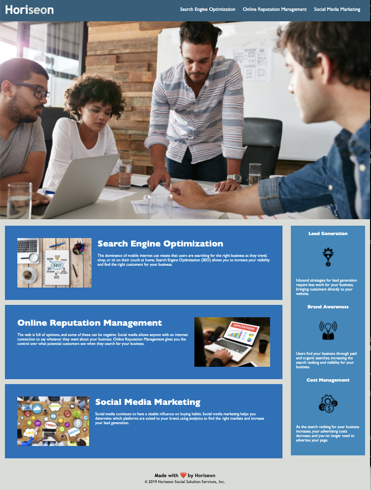
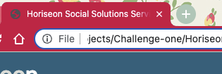

# Horiseon-Refractor-Challenge-

The Horiseon Refactor Challenge was created when AS A marketing agency, the codebase for the original Horiseon Website is refactored to improve accessibility standards SO THAT the website is optimized for search engines. 

## Description 

The two major changes made to the original code of this website are that images now include a detailed description for accessibility and a concise and descriptive title now provide keywords to facilitate the site to be find easier in search engines. It also now follows a logical and structured set of HTML and CSS elements for styling and positioning throughout.

VS Code was used to refactot the website's code. 

One of the challenges for this project was to understand that a background image on CSS does not necesarily need an alt description, but is used merely for asthetics. 

## Access

The website can be accessed from Github repository:

https://github.com/Melpie10/Horiseon-Refractor-Challenge-.git

It can also be accessed on the live website: https://melpie10.github.io/Horiseon-Refractor-Challenge-/

 ## Visuals

The website looks like this when opened on Google Chrome: 
 

The title is now displayed in the tabs:

## Contributing

Pull requests are welcomed. If you would like to suggest major/significant changes, please open a comment to suggest changes. 

## Support

📫  If you would like to contact us, please email melany14@gmail.com as the marketing company that refactored the website most recently.

## Roadmap

The layout for this website is currently only designed for "Desktop". In the future, this website will be re-coded for a resolution larger than 768px and will be responsive for web application and optimized for any screen size. 